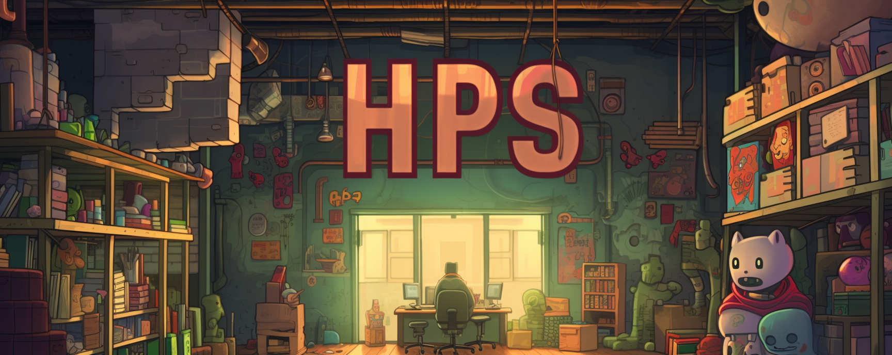
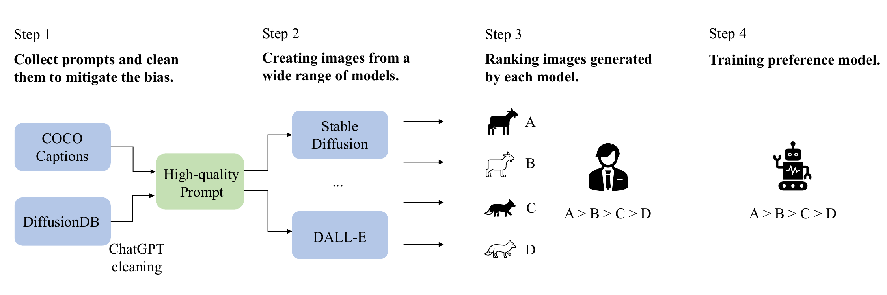

<p align="center"><br></p>

# HPS v2: Benchmarking Text-to-Image Generative Models

[](https://pypi.org/project/hpsv2/)

[](https://arxiv.org/abs/2306.09341)
[](https://huggingface.co/spaces/xswu/HPSv2)
[](https://www.apache.org/licenses/LICENSE-2.0.html)

This is the official repository for the paper: [Human Preference Score v2: A Solid Benchmark for Evaluating Human Preferences of Text-to-Image Synthesis](https://arxiv.org/abs/2306.09341). 

## Updates
*  [08/02/2023] We released the [PyPI package](https://pypi.org/project/hpsv2/). You can learn how to use it from the [Quick start section](#quick-start).
*  [08/02/2023] Updated [test.json](https://huggingface.co/datasets/zhwang/HPDv2/blob/main/test.json) to include raw annotation by each annotator.
*  [07/29/2023] We included `SDXL Refiner 0.9` model in the benchmark.
*  [07/29/2023] We released [the benchmark and HPD v2 test data](https://huggingface.co/datasets/zhwang/HPDv2). HPD v2 train data will be released soon.
*  [07/27/2023] We included `SDXL Base 0.9` model in the benchmark.
*  [07/26/2023] We updated our [compressed checkpoint](https://huggingface.co/spaces/xswu/HPSv2/resolve/main/HPS_v2_compressed.pt).
*  [07/19/2023] Live demo is available at 🤗[Hugging Face](https://huggingface.co/spaces/xswu/HPSv2).
*  [07/18/2023] We released our [test data](https://mycuhk-my.sharepoint.com/:u:/g/personal/1155172150_link_cuhk_edu_hk/EVnjOngvDO1MhIp7hVr8GXgBmxVDcSk7s9Xuu9srO4YLbA?e=8PqYud).

## Overview 
<p align="center"><br></p>

**Human Preference Dataset v2 (HPD v2)**: a large-scale (798k preference choices / 430k images), a well-annotated dataset of human preference choices on images generated by text-to-image generative models. 

**Human Preference Score v2 (HPS v2)**: a preference prediction model trained on HPD v2. HPS v2 can be used to compare images generated with the same prompt. We also provide a fair, stable, and easy-to-use set of evaluation prompts for text-to-image generative models.

## The HPS v2 benchmark
The HPS v2 benchmark evaluates models' capability of generating images of 4 styles: *Animation*, *Concept-art*, *Painting*, and *Photo*. 

**The benchmark is actively updating, email us @ tgxs002@gmail.com or raise an issue if you feel your model/method needs to be included in this benchmark!**

| Model                 | Animation | Concept-art | Painting | Photo    | Averaged |
| ---------------------| --------- | ----------- | -------- | -------- | -------- |
| Dreamlike Photoreal 2.0 | 28.24  | 27.60      | 27.59   | 27.99   | 27.86 |
| SDXL Refiner 0.9      | 28.45    | 27.66      | 27.67   | 27.46   | 27.80 |
| Realistic Vision      | 28.22    | 27.53      | 27.56   | 27.75   | 27.77 |
| SDXL Base 0.9         | 28.42    | 27.63      | 27.60   | 27.29   | 27.73 |
| Deliberate            | 28.13     | 27.46      | 27.45   | 27.62   | 27.67 |
| ChilloutMix           | 27.92    | 27.29      | 27.32   | 27.61   | 27.54 |
| MajicMix Realistic    | 27.88    | 27.19      | 27.22   | 27.64   | 27.48 |
| Openjourney           | 27.85    | 27.18      | 27.25   | 27.53   | 27.45 |
| DeepFloyd-XL          | 27.64    | 26.83      | 26.86   | 27.75   | 27.27 |
| Epic Diffusion        | 27.57    | 26.96      | 27.03   | 27.49   | 27.26 |
| Stable Diffusion v2.0 | 27.48    | 26.89      | 26.86   | 27.46   | 27.17 |
| Stable Diffusion v1.4 | 27.26    | 26.61      | 26.66   | 27.27   | 26.95 |
| DALL·E 2              | 27.34    | 26.54      | 26.68   | 27.24   | 26.95 |
| Versatile Diffusion   | 26.59    | 26.28      | 26.43   | 27.05   | 26.59 |
| CogView2              | 26.50    | 26.59      | 26.33   | 26.44   | 26.47 |
| VQGAN + CLIP          | 26.44    | 26.53      | 26.47   | 26.12   | 26.39 |
| DALL·E mini           | 26.10    | 25.56      | 25.56   | 26.12   | 25.83 |
| Latent Diffusion      | 25.73    | 25.15      | 25.25   | 26.97   | 25.78 |
| FuseDream             | 25.26    | 25.15      | 25.13   | 25.57   | 25.28 |
| VQ-Diffusion          | 24.97    | 24.70      | 25.01   | 25.71   | 25.10 |
| LAFITE                | 24.63    | 24.38      | 24.43   | 25.81   | 24.81 |
| GLIDE                 | 23.34    | 23.08      | 23.27   | 24.50   | 23.55 |

## Quick Start

### Installation

```shell
# Method 1: Pypi download and install
pip install hpsv2

# Method 2: install locally
git clone https://github.com/tgxs002/HPSv2.git
cd HPSv2
python -m pip install . 

# Optional: checkpoint and images will be downloaded here
# default: ~/.cache/hpsv2/
export HPS_ROOT=/your/cache/path
```

After installation, we show how to:
- [Compare images using HPS v2](#image-comparison).
- [Reproduce our benchmark](#benchmark-reproduction).
- [Evaluate your own model using HPS v2](#custom-evaluation).
- [Evaluate our preference model](#preference-model-evaluation).

We also provide [command line interfaces](#command-line-interface) for debugging purposes.

### Image Comparison

You can score and compare several images generated by the same prompt by running the following code:

```python
import hpsv2

result = hpsv2.score(imgs_path, '<prompt>') 
# imgs_path can be a list of image paths, with the images generated by the same prompt
# or image path of string type
# or image of PIL.Image.Image type
```

**Note**: Comparison is only meaningful for images generated by the **same prompt**.


### Benchmark Reproduction

We also provide [images](https://huggingface.co/datasets/zhwang/HPDv2/tree/main/benchmark/benchmark_imgs) generated by models in our [benchmark](#the-hps-v2-benchmark) used for evaluation. You can easily download the data and evaluate the models by running the following code.

```python
import hpsv2

print(hpsv2.available_models) # Get models that have access to data
hpsv2.evaluate_benchmark('<model_name>')
```

### Custom Evaluation

To evaluate your own text-to-image generative model, you can prepare the images for evaluation base on the [benchmark prompts](https://huggingface.co/datasets/zhwang/HPDv2/tree/main/benchmark) we provide by running the following code:

```python
import os
import hpsv2

# Get benchmark prompts (<style> = all, anime, concept-art, paintings, photo)
all_prompts = hpsv2.benchmark_prompts('all') 

# Iterate over the benchmark prompts to generate images
for style, prompts in all_prompts.items():
    for prompt in prompts:
        image = TextToImageModel(prompt) 
        # TextToImageModel is the model you want to evaluate
        image.save(os.path.join("<image_path>", style, "<image_name>")) 
        # <image_path> is the folder path to store generated images, as the input of hpsv2.evaluate().
        # <image_name> is of the form of '00xxx.jpg', with 'xxx' ranging from '000' to '799' corresponding to each prompt.

```

And then run the following code to conduct evaluation:

```python
import hpsv2

hpsv2.evaluate("<images_path>") 
# <image_path> is the same as <image_path> in the prevoius part
```

### Preference Model Evaluation

Evaluating HPS v2's correlation with human preference choices:
|  Model | Acc. on ImageReward test set (%)| Acc. on HPD v2 test set (%) | Acc. on new test set (%) |
| :-----: | :-----: |:-----: |:-----: |
|  [Aesthetic Score Predictor](https://github.com/christophschuhmann/improved-aesthetic-predictor) | 57.4 | 76.8 | - |
|  [ImageReward](https://github.com/THUDM/ImageReward) | 65.1 | 74.0 | - |
|  [HPS](https://github.com/tgxs002/align_sd) | 61.2 | 77.6 | - |
|  [PickScore](https://github.com/yuvalkirstain/PickScore) | 62.9 | 79.8 | - |
|  Single Human | 65.3 | 78.1 | 65.4* | 
|  HPS v2 | 65.7 | 83.3 | 73.2* |

\* The *new test set* is another test set annotated similarly to the HPD v2 test set, except that images are generated from 10 better models (Dreamlike Photoreal 2.0, SDXL Refiner 0.9, Realistic Vision, SDXL Base 0.9, Deliberate, ChilloutMix, MajicMix Realistic, Openjourney, DeepFloyd-XL, Epic Diffusion).

HPS v2 checkpoint can be downloaded from [here](https://huggingface.co/spaces/xswu/HPSv2/resolve/main/HPS_v2_compressed.pt). The model and live demo is also hosted on 🤗 Hugging Face at [here](https://huggingface.co/spaces/xswu/HPSv2).

Run the following commands to evaluate the HPS v2 model on HPD v2 test set and ImageReward test set **(Need to install the package `hpsv2` first)**:
```shell
# evaluate on HPD v2 test set
python evaluation.py --data-type test --data-path /path/to/HPD --image-path /path/to/image_folder

# evaluate on ImageReward test set
python evaluation.py --data-type ImageReward --data-path /path/to/IR --image-path /path/to/image_folder
```

## Human Preference Dataset v2
The prompts in our dataset are sourced from DiffusionDB and MSCOCO Captions. Prompts from DiffusionDB are first cleaned by ChatGPT to remove biased function words. Human annotators are tasked to rank images generated by different text-to-image generative models from the same prompt. Totally there are about 798k pairwise comparisons of images for over 430k images and 107k prompts, 645k pairs for training split and 153k pairs for test split.

Image sources of HPD v2:
|  Source | # of images 
| :-----: | :-----: |
| CogView2 | 73697 |
| DALL·E 2 | 101869 | 
| GLIDE (mini) | 400 |
| Stable Diffusion v1.4 | 101869 |
| Stable Diffusion v2.0 | 101869 | 
| LAFITE | 400 | 
| VQ-GAN+CLIP | 400 |
| VQ-Diffusion | 400 |
| FuseDream | 400 |
| COCO Captions | 28272 |

Currently, the test data can be downloaded from [here](https://huggingface.co/datasets/zhwang/HPDv2). You can inspect the test data at [https://tgxs002.github.io/hpd_test_vis/](https://tgxs002.github.io/hpd_test_vis/). Here is a screenshot:


The training dataset will be **released soon**.
Once unzipped, you should get a folder with the following structure:
```
HPD
---- train/
-------- {image_id}.jpg
---- test/
-------- {image_id}.jpg
---- train.json
---- test.json
---- benchmark/
-------- benchmark_imgs/
------------ {model_id}/
---------------- {image_id}.jpg
-------- drawbench/
------------ {model_id}/
---------------- {image_id}.jpg
-------- anime.json
-------- concept-art.json
-------- paintings.json
-------- photo.json
-------- drawbench.json
```

The annotation file, `train.json`, is organized as:
```
[
    {
        'human_preference': list[int], # 1 for preference
        'prompt': str,
        'file_path': list[str],
        'user_hash': str,
    },
    ...
]
```

The annotation file, `test.json`, is organized as:
```
[
    {
        'prompt': str,
        'image_path': list[str],
        'rank': list[int], # averaged ranking result for image at the same index in image_path,
        'raw_annotation': list[{'rank', 'user_hash'}]  # raw ranking result from each annotator
    },
    ...
]
```

The benchmark prompts file, ie. `anime.json` is pure prompts. The corresponding image can be found in the folder of the corresponding model by indexing the prompt.

## Command Line Interface

### Evaluating Text-to-image Generative Models using HPS v2
The generated images in our experiments can be downloaded from [here](https://mycuhk-my.sharepoint.com/:u:/g/personal/1155172150_link_cuhk_edu_hk/EVnjOngvDO1MhIp7hVr8GXgBmxVDcSk7s9Xuu9srO4YLbA?e=8PqYud). 

The following script reproduces the [benchmark table](#the-hps-v2-benchmark) and our results on DrawBench (reported in the paper) **(Need to install the package `hpsv2` first)**:
```shell
# HPS v2 benchmark (for more than one models)
python evaluation.py --data-type benchmark_all --data-path /path/to/HPD/benchmark --image-path /path/to/benchmark_imgs

# HPS v2 benchmark (for only one models)
python evaluation.py --data-type benchmark --data-path /path/to/HPD/benchmark --image-path /path/to/benchmark_imgs/${model_name}

# DrawBench
python evaluation.py --data-type drawbench --data-path /path/to/HPD/benchmark --image-path /path/to/drawbench_imgs
```

### Scoring Single Generated Image and Corresponding Prompt

We provide one example image in the `asset/images` directory of this repo. The corresponding prompt is `"A cat with two horns on its head"`.

Run the following commands to score the single generated image and the corresponding prompt **(Need to install the package `hpsv2` first)**:
```shell
python img_score.py --image-path assets/demo_image.jpg --prompt 'A cat with two horns on its head'
```
where the parameter `image-path` can accept multiple values.

## Train Human Preference Predictor
To train your own human preference predictor, just change the corresponding path in `configs/controller.sh` and run the following command:
```shell
# if you are running locally
bash configs/HPSv2.sh train 8 local
# if you are running on slurm
bash configs/HPSv2.sh train 8 ${quota_type}
```

## BibTeX
```
@article{wu2023human,
  title={Human Preference Score v2: A Solid Benchmark for Evaluating Human Preferences of Text-to-Image Synthesis},
  author={Wu, Xiaoshi and Hao, Yiming and Sun, Keqiang and Chen, Yixiong and Zhu, Feng and Zhao, Rui and Li, Hongsheng},
  journal={arXiv preprint arXiv:2306.09341},
  year={2023}
}
```
